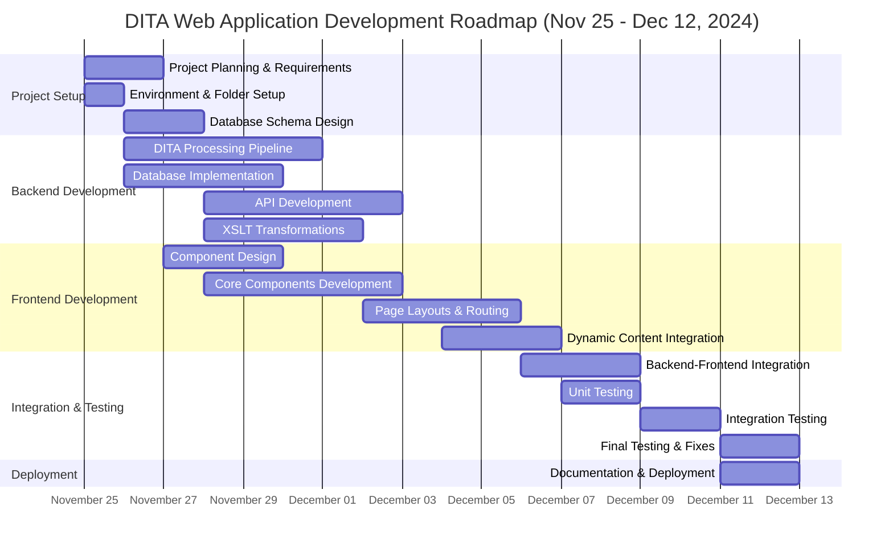

# Roadmap

## Development chart

## TODO
- [x] Add LaTeX support
- [ ] Develop image-loading features per specification
- [ ] Develop interactive content functionality
- [ ] Develop XML metadata usage structure to toggle UI elements
- [ ] Develop logic to store pages in the Output folder and replace them only if a change to the dita topics or dita map is detected
- [ ] Develop Bibliography component with topic parser and JSON support
- [ ] Develop PDF conversion logic with Pandoc
