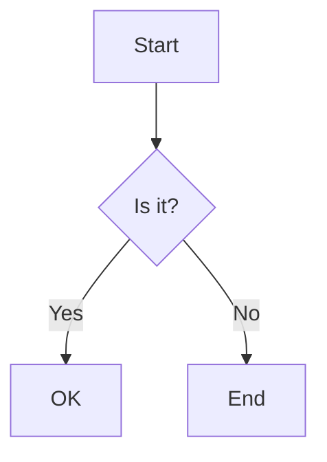

# Markdown Syntax Reference

## Basic Syntax

### Headers
```markdown
# H1 Header
## H2 Header
### H3 Header
#### H4 Header
##### H5 Header
###### H6 Header
```

### Emphasis
```markdown
*Italic text* or _italic text_
**Bold text** or __bold text__
***Bold and italic*** or ___bold and italic___
~~Strikethrough text~~
```

### Lists

Unordered lists:
```markdown
* Item 1
* Item 2
  * Subitem 2.1
  * Subitem 2.2
    * Subsubitem 2.2.1

- Alternative item 1
- Alternative item 2
  - Subitem 2.1
```

Ordered lists:
```markdown
1. First item
2. Second item
   1. Subitem 2.1
   2. Subitem 2.2
      1. Subsubitem 2.2.1
```

Task lists:
```markdown
- [x] Completed task
- [ ] Incomplete task
  - [x] Completed subtask
  - [ ] Incomplete subtask
```

### Links and Images

Links:
```markdown
[Link text](https://example.com)
[Link with title](https://example.com "Link title")
[Reference link][reference]

[reference]: https://example.com
```

Images:
```markdown


![Reference image][image-ref]

[image-ref]: path/to/image.jpg
```

### Code

Inline code:
```markdown
Use `code` in your text.
```

Fenced code blocks:
````markdown
```python
def hello_world():
    print("Hello, world!")
```

```javascript
function helloWorld() {
    console.log("Hello, world!");
}
```
````

### Tables

Basic table:
```markdown
| Header 1 | Header 2 |
|----------|----------|
| Cell 1   | Cell 2   |
| Cell 3   | Cell 4   |
```

Aligned table:
```markdown
| Left-aligned | Center-aligned | Right-aligned |
|:-------------|:-------------:|-------------:|
| Left         | Center        | Right        |
| Left         | Center        | Right        |
```

### Blockquotes

Basic blockquote:
```markdown
> This is a blockquote
> Continued on next line

> Nested blockquotes
>> Second level
>>> Third level
```

### Horizontal Rules

```markdown
---
***
___
```

## Extended Syntax

### Definition Lists
```markdown
Term 1
: Definition 1
: Another definition 1

Term 2
: Definition 2
```

### Footnotes
```markdown
Here's a sentence with a footnote[^1].
Here's another sentence with a footnote[^note].

[^1]: This is the footnote content.
[^note]: Named footnotes work too.
```

### Abbreviations
```markdown
*[HTML]: Hyper Text Markup Language
*[W3C]: World Wide Web Consortium

The HTML specification is maintained by the W3C.
```

### Custom Attributes
```markdown
This is a paragraph.
{: .class-name #paragraph-id }

[Link](http://example.com){: .link-class }
```

### Table of Contents
```markdown
[TOC]

# Your content starts here
```

### Math Expressions
```markdown
Inline math: $E = mc^2$

Block math:
$$
\begin{align}
y = y(x,t) &= A e^{i\theta} \\
&= A (\cos \theta + i \sin \theta) \\
&= A (\cos(kx - \omega t) + i \sin(kx - \omega t))
\end{align}
$$
```

### Admonitions/Callouts
```markdown
!!! note "Optional Title"
    This is a note admonition.

!!! warning ""
    This is a warning admonition with no title.

??? tip "Collapsible"
    This is a collapsible tip admonition.
```

### Description Lists
```markdown
First Term
: This is the definition of the first term.

Second Term
: This is one definition of the second term.
: This is another definition of the second term.
```

### Line Numbers in Code Blocks
````markdown
```python linenums="1"
def hello_world():
    print("Hello, world!")
    return True
```
````

### Metadata Block (YAML Front Matter)
```yaml
---
title: Document Title
subtitle: Document Subtitle
author: Author Name
date: 2024-11-28
abstract: |
  This is a multi-line
  abstract for the document.
keywords:
  - keyword1
  - keyword2
references:
  - id: ref1
    title: Reference Title
    author: Reference Author
    year: 2024
bibliography: references.bib
---
```

### Comments
```markdown
[//]: # (This is a comment that won't appear in the output)
[//]: # "Also a comment"
[//]: # 'Also a comment'
```

## Special Formatting Examples

### Text Alignment
```markdown
<div style="text-align: center">
Centered text
</div>

<div style="text-align: right">
Right-aligned text
</div>
```

### Subscript and Superscript
```markdown
H~2~O
X^2^
```

### Keyboard Keys
```markdown
Press <kbd>Ctrl</kbd> + <kbd>Alt</kbd> + <kbd>Delete</kbd>
```

### Diagrams (Mermaid)
````markdown

````

### Tabs
```markdown
=== "Tab 1"
    Content of tab 1

=== "Tab 2"
    Content of tab 2
```

Note: The actual availability and rendering of these features depends on:
1. Which Python-Markdown extensions are enabled in our implementation
2. Our custom CSS styling
3. Additional libraries or processors installed
4. The HTML sanitization settings in our environment

For the most reliable results, stick to basic Markdown syntax and the features explicitly supported by our processor configuration.
